# **eFlex - Hệ thống hỗ trợ học tập dựa trên năng lực cá nhân**

Đây là dự án "Đồ án cơ sở" của sinh viên ngành Công nghệ Phần mềm. Dự án xây dựng một hệ thống e-learning cá nhân hóa, giúp người dùng học tập theo lộ trình riêng, phù hợp với năng lực và mục tiêu của bản thân.

---

## Tổng quan Giao diện

| Đăng nhập | Đăng ký | Trang chủ |
| :-----------------: | :-----------------: | :-----------------: |
| 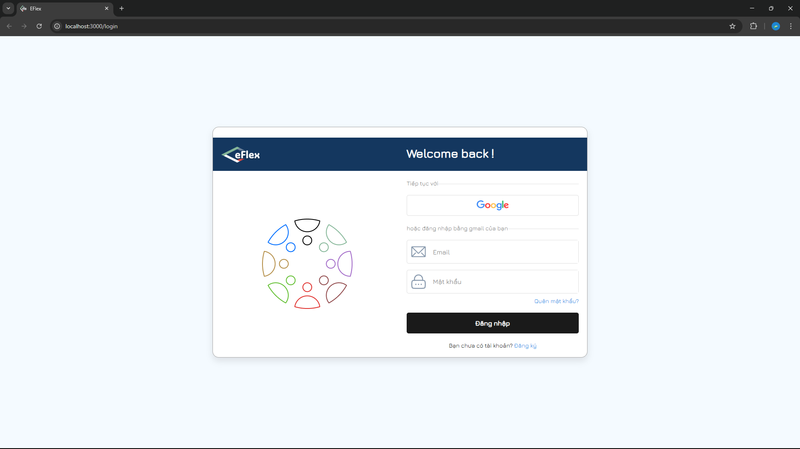 | 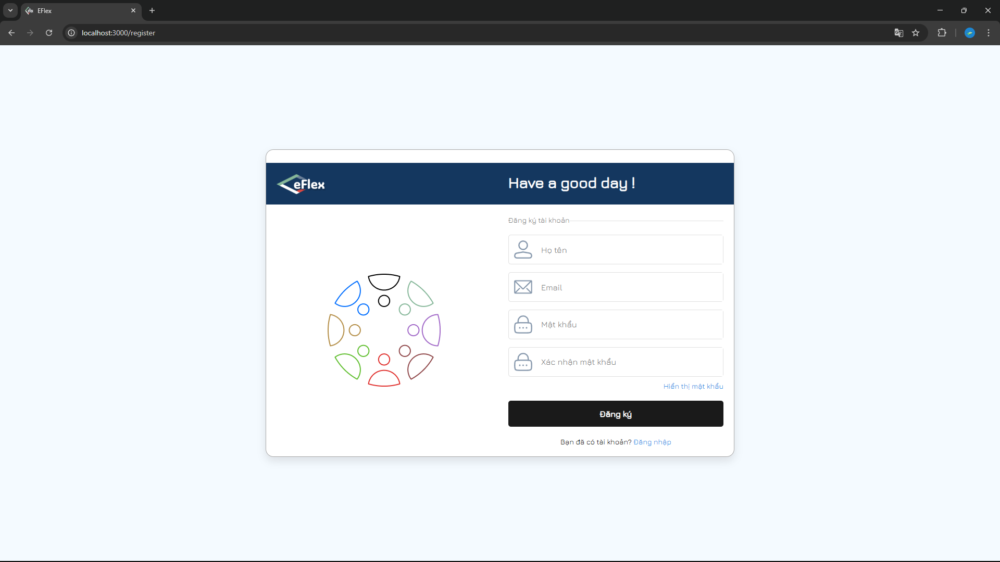 | 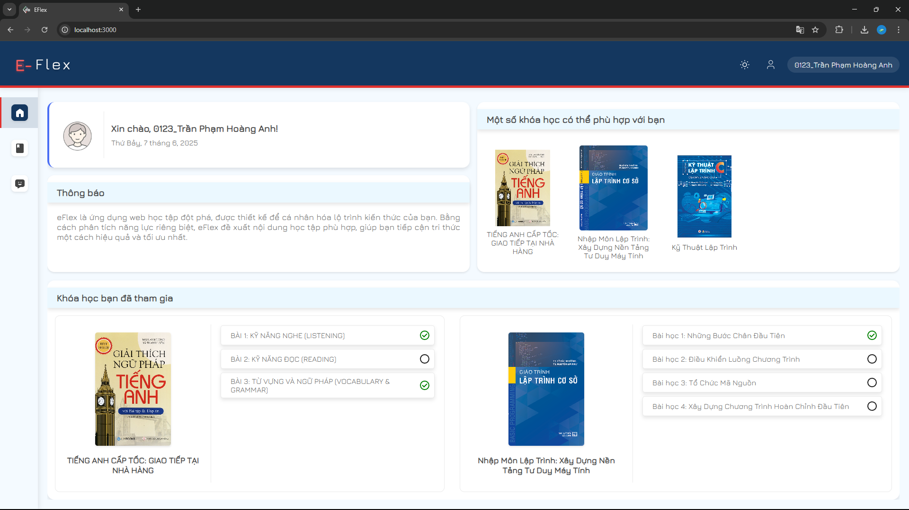 |
| Danh sách khóa học | **Chatbot** | **Chi tiết khóa học** |
| 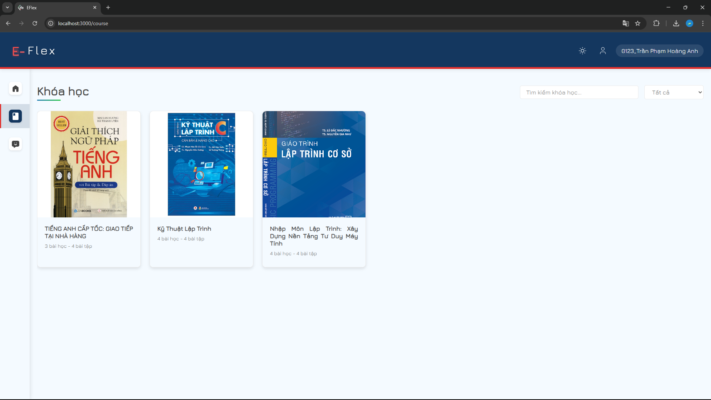 | 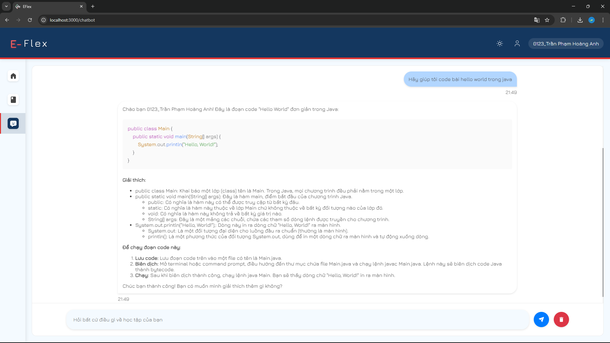 | 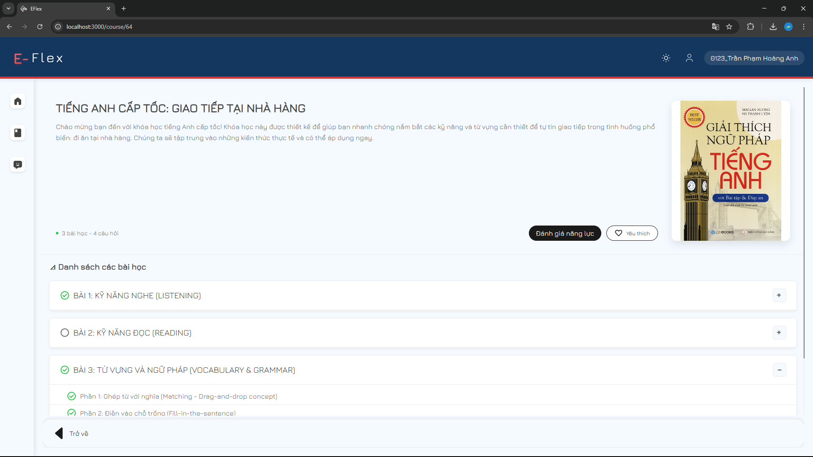 |
| **Chi tiết bài học** | **Danh sách bài kiểm tra** | **Kiểm tra trắc nghiệm** |
|  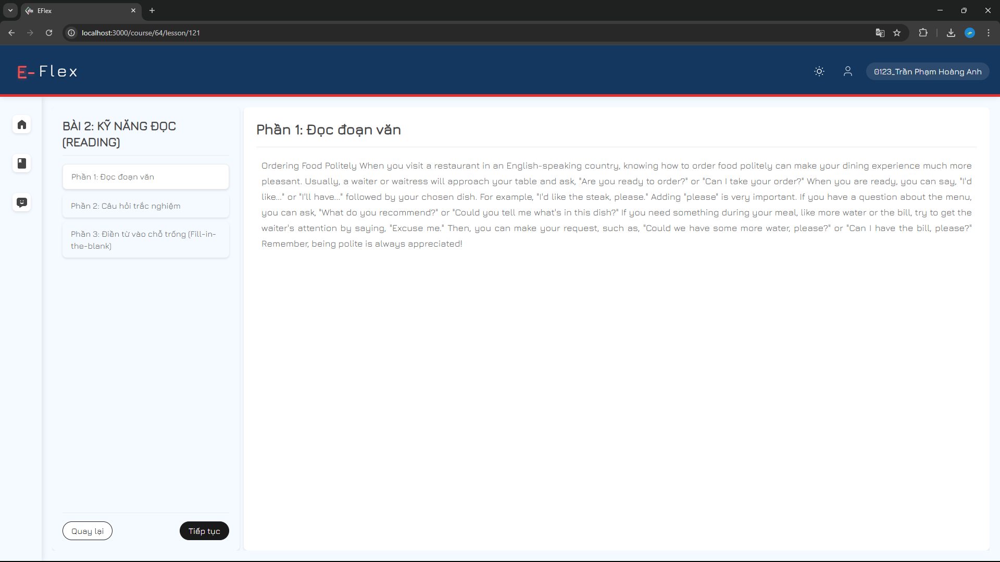 | 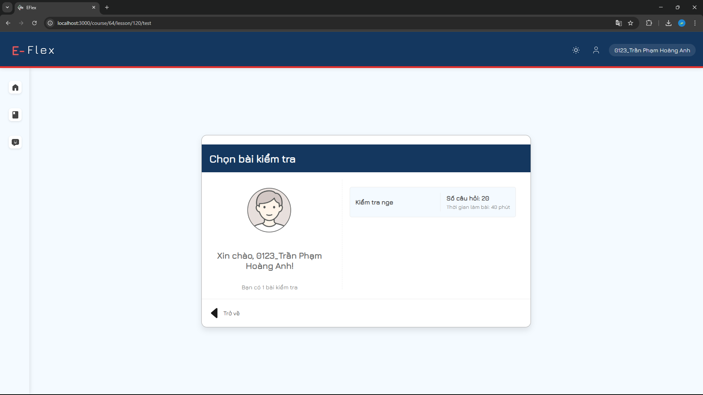 | 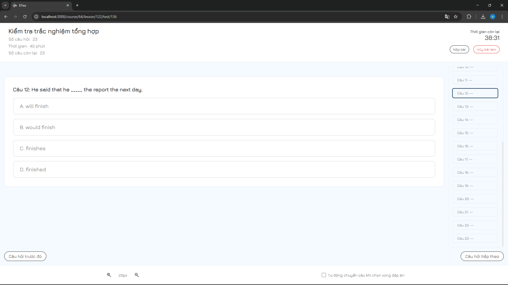 |
| **Kiểm tra đọc hiểu** | **Kiểm tra nghe** | **Đề xuất bài học** |
| 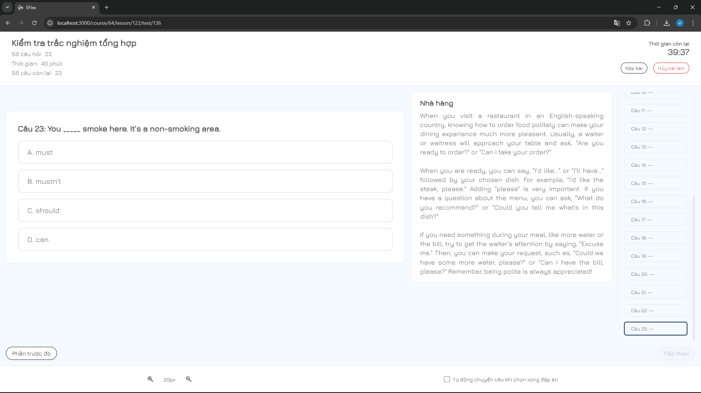 | 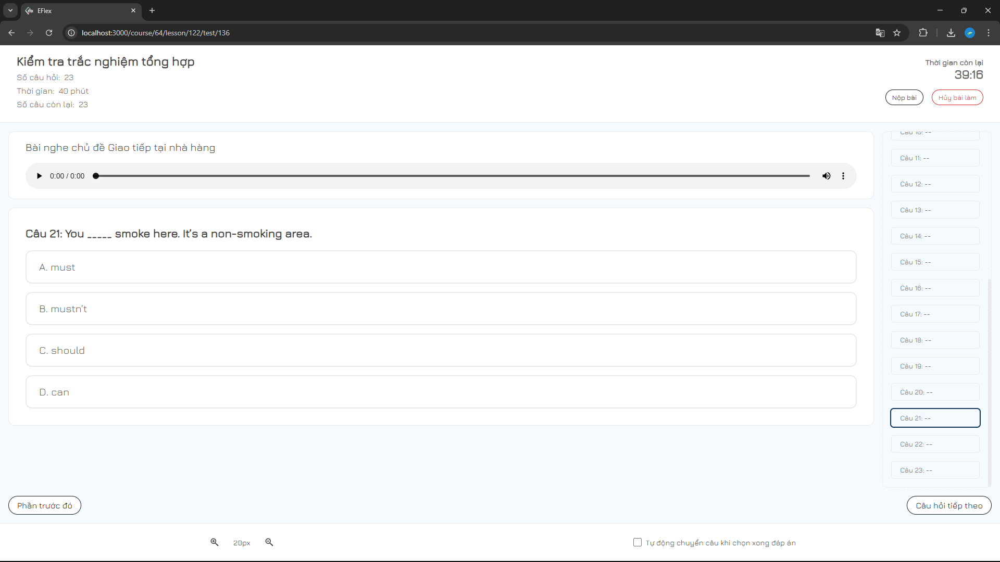 | 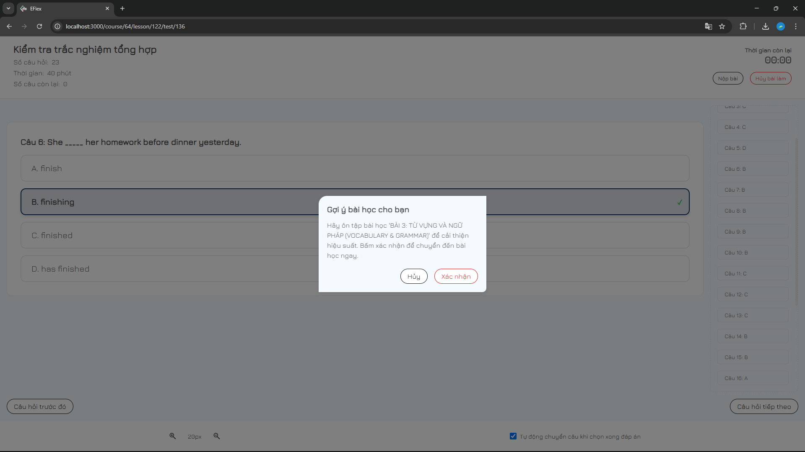 |

---

## Tính năng chính

### Dành cho Người dùng (Học viên)

-   **Đăng ký/Đăng nhập:** Hỗ trợ đăng ký bằng email và đăng nhập qua Google (OAuth2).
-   **Khám phá Khóa học:** Tìm kiếm, lọc và xem chi tiết các khóa học có sẵn.
-   **Học tập theo Lộ trình:** Tham gia vào các khóa học, theo dõi tiến độ qua từng chương, từng bài học.
-   **Làm bài tập & Kiểm tra:** Thực hiện các bài kiểm tra trắc nghiệm, đọc hiểu, nghe hiểu để củng cố kiến thức.
-   **Lịch sử học tập:** Xem lại các khóa học đã tham gia và kết quả các bài kiểm tra.
-   **Hệ thống gợi ý:** Đề xuất các khóa học phù hợp dựa trên lịch sử và năng lực.
-   **Chatbot:** Hỗ trợ giải đáp các thắc mắc nhanh chóng.
-   **Quản lý tài khoản:** Cập nhật thông tin cá nhân và bảo mật.

### Dành cho Quản trị viên (Admin)

-   **Dashboard tổng quan:** Thống kê số lượng người dùng, khóa học, và các hoạt động khác.
-   **Quản lý Người dùng:** Xem danh sách, tìm kiếm, khóa/mở khóa tài khoản người dùng.
-   **Quản lý Khóa học:** Thêm, sửa, xóa các khóa học, chương học (section) và bài học (lesson).
-   **Quản lý Bài kiểm tra:** Tạo và quản lý các bộ câu hỏi cho các bài kiểm tra.
-   **Quản lý Danh mục:** Tổ chức các khóa học theo từng danh mục cụ thể.

---

## Công nghệ sử dụng

| Phần | Công nghệ |
| :-------- | :----------------------------------------------------------------------------------------------------------------------------------- |
| **Backend** |  **Java 17**, **Spring Boot 3**, Spring Security, Spring Data JPA  **JWT**, **OAuth 2.0** (Google Login)  **MySQL** (Database chính), **Redis** (Caching)  **Cloudinary** (Lưu trữ hình ảnh, video, audio)  **Java Mail Sender** (Gửi email xác thực)  **Docker** (Đóng gói backend) |
| **Frontend** |  **ReactJS**, React Router, React Hooks  **CSS3**  **Fetch**  **NPM** |

---

### Thành viên nhóm

| Tên thành viên | Nhiệm vụ chính |
| :--- | :--- |
| [Nguyễn Toàn Thắng](https://github.com/imthq1) | Phân tích & Thiết kế hệ thống, Phát triển Backend, Triển khai (Docker)|
| [Nguyễn Đức Thiện](https://github.com/nguyenducthienlq1) | Phân tích & Thiết kế hệ thống, Phát triển Backend |
| [Trần Phạm Hoàng Anh](https://github.com/HoaqAnh) | Thiết kế Giao diện (UI/UX), phát triển Frontend (ReactJS). |

---

## 📄 Giấy phép

Dự án này được cấp phép theo **Giấy phép MIT**. Xem chi tiết tại tệp [LICENSE](LICENSE).
